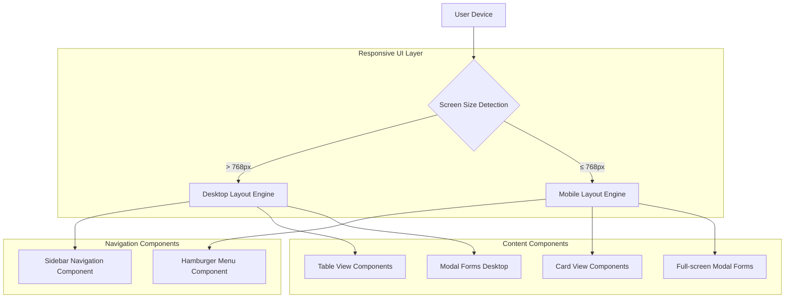
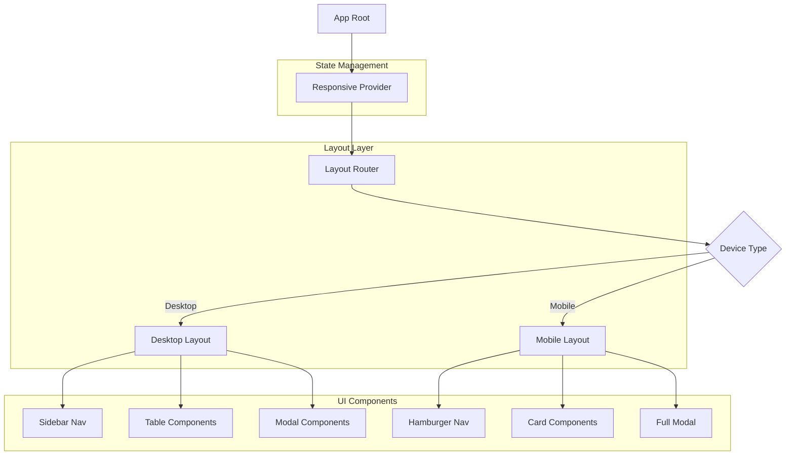

## 1. Architecture design



## 2. Technology Description

* **Frontend**: React\@18 + Tailwind CSS\@3 + Vite

* **Initialization Tool**: vite-init

* **Backend**: Supabase (existente)

* **CSS Framework**: Tailwind CSS com classes responsivas (sm:, md:, lg:)

* **State Management**: React Context para estado de responsividade

* **Animation Library**: CSS transitions nativas para animações suaves

## 3. Route definitions

| Route         | Purpose                              | Responsive Behavior                    |
| ------------- | ------------------------------------ | -------------------------------------- |
| /dashboard    | Dashboard principal com estatísticas | Cards empilham verticalmente no mobile |
| /equipamentos | Gestão de equipamentos               | Tabela vira cards no mobile            |
| /chamados     | Gestão de chamados                   | Tabela vira cards no mobile            |
| /relatorios   | Visualização de relatórios           | Gráficos responsivos, cards empilhados |
| /termo        | Termo de responsabilidade            | Ajuste de margens e fonte no mobile    |

## 4. Component Architecture

### 4.1 Responsive Layout Components

**Layout Wrapper Component**

```typescript
interface ResponsiveLayoutProps {
  children: React.ReactNode;
  breakpoint?: number;
}

const ResponsiveLayout: React.FC<ResponsiveLayoutProps> = ({ 
  children, 
  breakpoint = 768 
}) => {
  // Lógica de detecção de tamanho de tela
  // Renderização condicional de layout
}
```

**Navigation Component**

```typescript
interface NavigationProps {
  isMobile: boolean;
  menuOpen: boolean;
  onMenuToggle: () => void;
}
```

**Table/Card Switcher**

```typescript
interface DataDisplayProps {
  data: any[];
  columns: ColumnConfig[];
  isMobile: boolean;
}
```

### 4.2 Responsive Utilities

**Screen Size Detection Hook**

```typescript
const useResponsive = () => {
  const [isMobile, setIsMobile] = useState(false);
  const [screenWidth, setScreenWidth] = useState(window.innerWidth);
  
  // Lógica de resize listener
  // Retorna: isMobile, isDesktop, screenWidth
}
```

## 5. CSS Architecture

### 5.1 Breakpoint System

```css
/* Mobile First Approach */
/* Default styles for mobile */
.component {
  @apply w-full p-4;
}

/* Desktop overrides */
@media (min-width: 769px) {
  .component {
    @apply w-auto p-6;
  }
}

/* Tailwind Responsive Classes */
.mobile-card {
  @apply block md:hidden;
}

.desktop-table {
  @apply hidden md:table;
}
```

### 5.2 Mobile-specific Classes

```css
/* Touch-friendly components */
.touch-button {
  @apply min-h-[44px] min-w-[44px];
}

.touch-input {
  @apply min-h-[48px] text-base;
}

/* Mobile modal */
.mobile-modal {
  @apply w-[95vw] max-w-full mx-2;
}
```

## 6. Component Structure



## 7. Performance Optimization

### 7.1 Lazy Loading Strategy

* Componentes de desktop/mobile carregados sob demanda

* Imagens otimizadas para diferentes tamanhos de tela

* Code splitting por tipo de dispositivo

### 7.2 Mobile Optimizations

* Redução de animações pesadas

* Compressão de assets

* Touch event handlers otimizados

* Debounce em eventos de scroll/resize

## 8. Testing Strategy

### 8.1 Responsive Testing Matrix

| Device         | Width   | Priority | Key Features           |
| -------------- | ------- | -------- | ---------------------- |
| iPhone SE      | 375px   | High     | Menu hambúrguer, cards |
| Android Medium | 412px   | High     | Forms modais, tabelas  |
| iPad           | 768px   | Medium   | Transição desktop      |
| Desktop        | 1024px+ | High     | Layout original        |

### 8.2 Browser Compatibility

* Chrome Mobile (iOS/Android)

* Safari Mobile

* Firefox Mobile

* Edge Mobile

