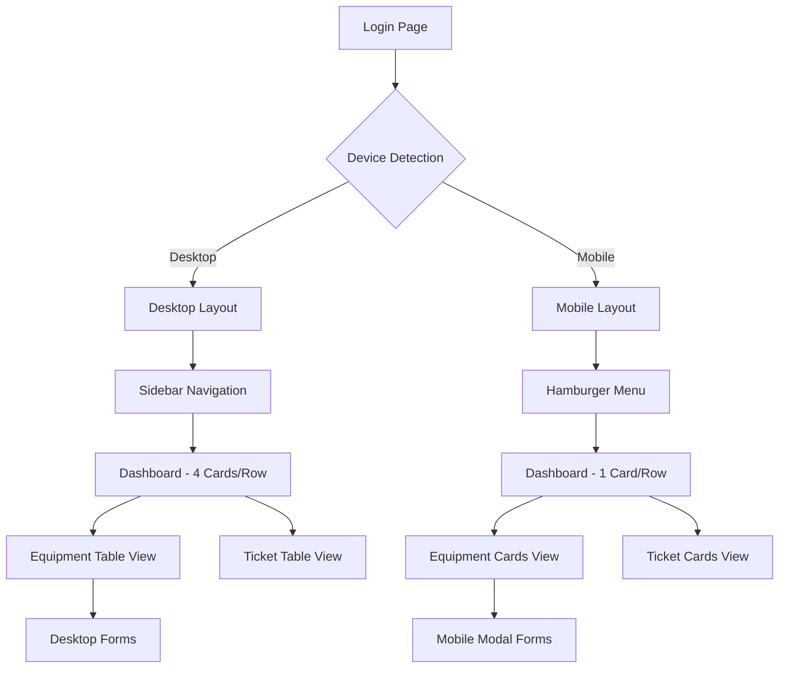

## 1. Product Overview
Implementação completa de design responsivo para aplicação help desk, adaptando layout e disposição de elementos para funcionar perfeitamente em desktop e mobile sem alterar cores, fontes ou identidade visual existente.

O objetivo é garantir que a mesma aplicação funcione bem em telas pequenas, transformando tabelas em cards no mobile e ajustando apenas a organização visual dos componentes.

## 2. Core Features

### 2.1 User Roles
| Role | Registration Method | Core Permissions |
|------|---------------------|------------------|
| Admin User | Email registration | Full system access, manage equipment and tickets |
| Technician User | Admin invitation | View and update assigned tickets, equipment management |
| Regular User | Email registration | Create tickets, view own tickets history |

### 2.2 Feature Module
A aplicação help desk consiste nas seguintes páginas principais:
1. **Dashboard**: estatísticas, cards de métricas, gráficos de pizza e barras
2. **Equipment Management**: tabela/lista de equipamentos, formulários CRUD
3. **Ticket Management**: tabela de chamados, formulários de criação/edição
4. **Reports**: visualização de relatórios e estatísticas detalhadas
5. **Responsibility Term**: documento visual e download

### 2.3 Page Details
| Page Name | Module Name | Feature description |
|-----------|-------------|---------------------|
| Dashboard | Statistics Cards | Display 4 metric cards (Tempo Médio, Taxa Resolução, Satisfação, Chamados Resolvidos) responsivos |
| Dashboard | Charts | Gráficos de pizza e barras responsivos com labels ajustados para mobile |
| Equipment Management | Equipment Table | Transformar tabela em cards no mobile com header, body e footer de ações |
| Equipment Management | Equipment Form | Modal responsivo com 95% largura, inputs grandes (48px altura mínima) |
| Ticket Management | Tickets Table | Converter tabela de chamados em cards verticais no mobile |
| Ticket Management | Ticket Form | Formulário modal adaptado para mobile com labels acima dos inputs |
| Reports | Report Cards | Cards de estatísticas empilhados verticalmente no mobile |
| Responsibility Term | Document Viewer | Ajustar margens e fonte para mobile mantendo layout A4 proporcional |

## 3. Core Process

### Admin Flow
1. Login na aplicação via desktop ou mobile
2. Acesso ao dashboard com métricas adaptadas ao tamanho da tela
3. Navegação via menu lateral (desktop) ou hambúrguer (mobile)
4. Gestão de equipamentos: visualização em tabela (desktop) ou cards (mobile)
5. Gestão de chamados: mesma lógica de adaptação tabela/cards
6. Geração de relatórios com layout responsivo

### Regular User Flow
1. Login adaptado ao dispositivo
2. Criação de chamados via formulário modal responsivo
3. Visualização própria de chamados em formato card no mobile
4. Acesso ao termo de responsabilidade com layout ajustado

## 4. User Interface Design

### 4.1 Design Style
- **Cores**: Manter exatamente as cores atuais do tema (sem alterações)
- **Botões**: Estilo atual preservado, apenas tamanho ajustado (mínimo 44px altura no mobile)
- **Fontes**: Mesmas fontes do desktop, tamanho base 16px no mobile
- **Layout**: Desktop mantém sidebar + conteúdo, mobile vira coluna única
- **Ícones**: Mesmos ícones atuais, apenas redimensionados proporcionalmente

### 4.2 Page Design Overview
| Page Name | Module Name | UI Elements |
|-----------|-------------|-------------|
| Dashboard | Statistics Cards | Cards coloridos mantidos, desktop: 4 por linha, mobile: 1 por linha vertical |
| Equipment Table | Mobile Cards | Cada card com: header (ID/nome), body (label: valor), footer (botões ação) |
| Navigation | Mobile Menu | Hambúrguer ☰ no topo, slide lateral com overlay semi-transparente, X para fechar |
| Forms | Mobile Modal | 95% largura tela, inputs 48px altura, labels acima dos campos, padding generoso |
| Reports | Charts | Gráficos responsivos, ocupam largura total container mobile, labels menores mas legíveis |

### 4.3 Responsiveness
- **Abordagem**: Desktop-first com adaptação mobile
- **Breakpoint principal**: 768px (max-width: 768px para mobile)
- **Touch optimization**: Áreas clicáveis mínimas, feedback visual ao toque
- **Performance**: Lazy loading, animações otimizadas para 3G/4G

### 4.4 Mobile Behaviors
- Desabilitar hover effects no mobile
- Adicionar ripple effect nas cores do tema ao toque
- Scroll suave em listas longas
- Áreas clicáveis expandidas para botões pequenos